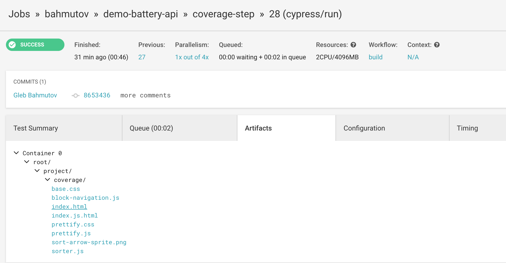
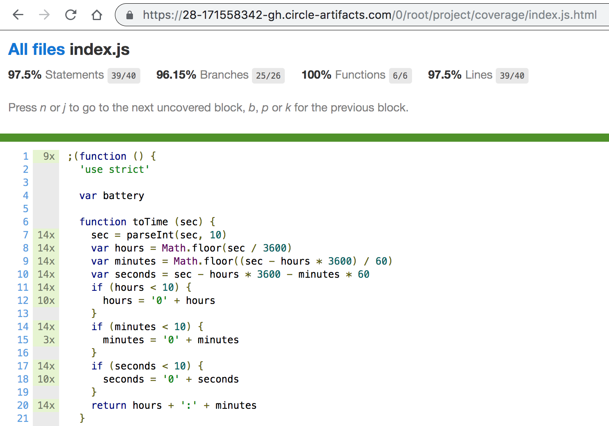

# Cypress tests for Battery Status API with code coverage step [](https://circleci.com/gh/bahmutov/demo-battery-api/tree/coverage-step)

> Forked from [https://github.com/pazguille/demo-battery-api](https://github.com/pazguille/demo-battery-api) with its demo at [http://pazguille.github.io/demo-battery-api/](http://pazguille.github.io/demo-battery-api/)

Branch [coverage-step](https://github.com/bahmutov/demo-battery-api/tree/coverage-step)

## Use

```
git clone git@github.com:bahmutov/demo-battery-api.git
cd demo-battery-api
git checkout coverage-step
npm ci
npm run dev
```

Instrumented code from `src` folder will be placed in `build` folder and servers as the web application. After running Cypress you can see code coverage JSON file saved in the folder `.nyc_output`, and HTML report saved in the `coverage` folder. You can see the HTML report as a test artifact at [CircleCI](https://circleci.com/gh/bahmutov/demo-battery-api/tree/coverage-step)



Click on the `index.html` to open the static site, for example here is the start of the `index.js` file



## Read

- [Stub navigator API in end-to-end tests](https://glebbahmutov.com/blog/stub-navigator-api/)
- [Code Coverage for End-to-end Tests](https://glebbahmutov.com/blog/code-coverage-for-e2e-tests/)
