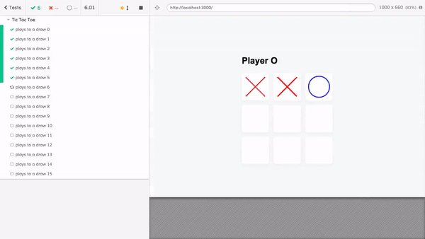

# tic-tac-toe

Source: David K. [@DavidKPiano](https://twitter.com/DavidKPiano)

- App https://codesandbox.io/s/j750nqvo2y
- Puppeteer script https://gist.github.com/davidkpiano/6344c75471d7927fbb7296393c9f9289

## Cypress tests

Use precomputed paths that lead to a draw (16 paths I think, see [cypress/fixtures](cypress/fixtures) folder). Each path is mapped to a test in [cypress/integration/spec.js](cypress/integration/spec.js), and at the end it verifies that "Draw" message appears. To run tests:

- start app from one terminal `npm start`
- start Cypress from another terminal `npx cypress open` and click `spec.js`

A gif how the tests look

